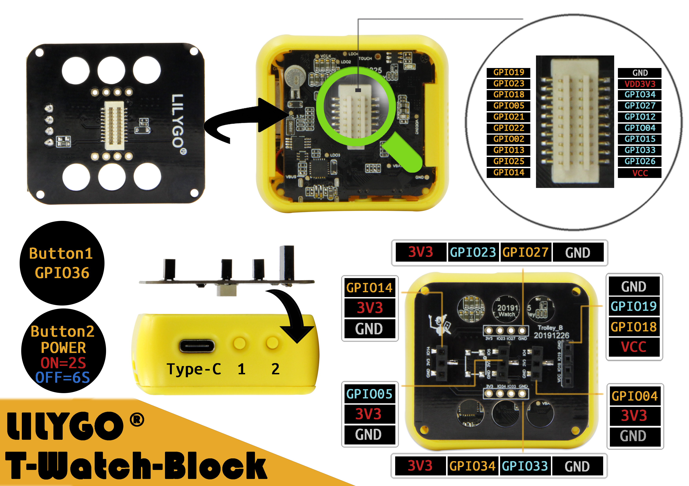
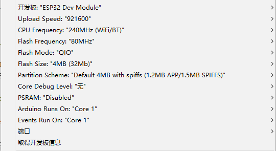
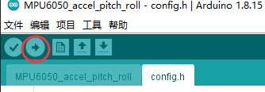

# <h1 align = "center">[🌟LilyGO T-Block🌟](https://lilygo.aliexpress.com/store/2090076/search?SearchText=t-block)</h1>

**English | [中文](docs/details_cn.md)**

## Quick start
1. Clone all the files of the [TTGO_TWatch_Library](https://github.com/Xinyuan-LilyGO/TTGO_TWatch_Library) library to the path of <Users\Your Name\Documents\Arduino\libraries>;

2. Open Arduino, File->Example->Select TTGO_TWatch_Library;

3. Select any example, such as the MPU6050_accel_pitch_roll example, click on the menu bar Tools -> Development Board -> ESP32 Dev Module
Keep other parameters as default or refer to the picture below (if ESP32 is not found, please refer to [video](https://www.bilibili.com/video/BV1QK411L7Yx/) or [ESP32 official tutorial](https://github.com/espressif/arduino-esp32));

 * Port selection actual connection port

3. Find the **config.h** configuration file and uncomment the model of the board to select the board;

4. Click the upload button in the upper left corner to start compiling and uploading;

5.When the following picture is displayed in the editor, the upload is successful;

## Q&A 
1. The port number is not found;
* Confirm that the serial port driver is installed successfully and the USB cable and the device are properly connected
2. When uploading, it keeps appearing....______...._____, and finally the upload fails
* Please make sure the selected port number is correct

