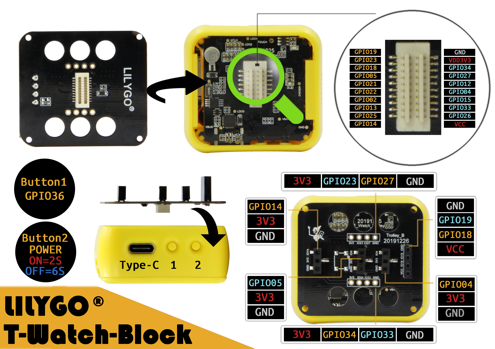
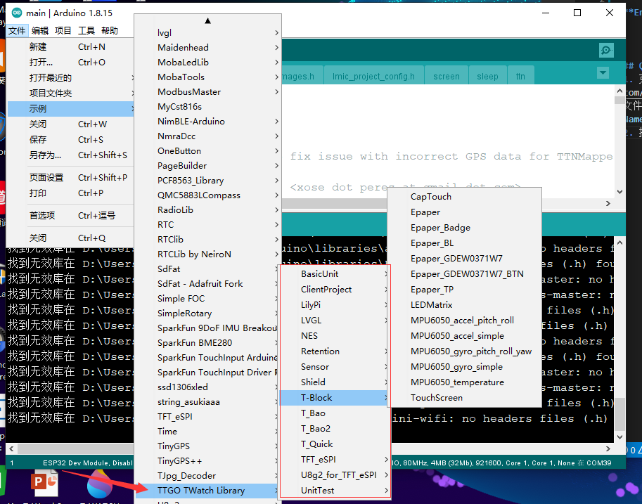
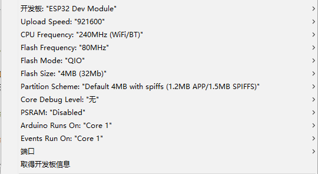
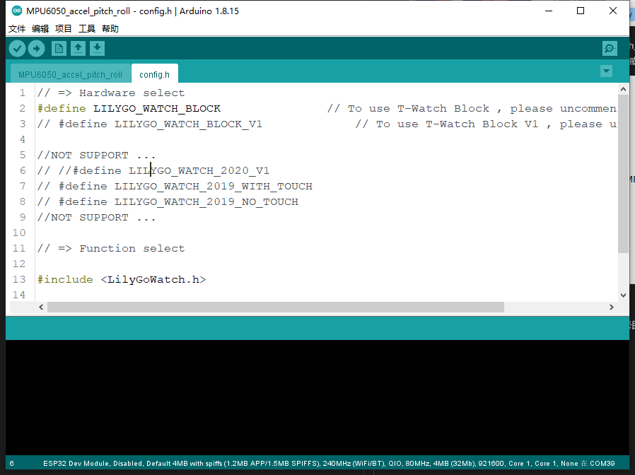
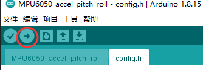
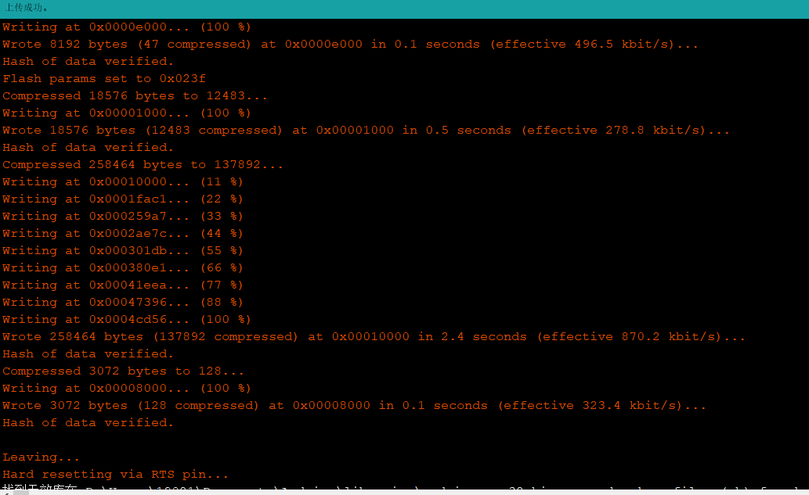

# <h1 align = "center">[🌟LilyGO T-Block🌟](https://shop135629592.taobao.com/category-1577592143.htm?spm=2013.1.w5842-23579470093.15.28a4716d5EOxi8&search=y&parentCatId=1496371963&parentCatName=T%CF%B5%C1%D0%D6%F7%BB%FA&catName=T-BLock#bd)</h1>

**[English](README.md) | 中文**

## Quick start
1. 克隆[TTGO_TWatch_Library](https://github.com/Xinyuan-LilyGO/TTGO_TWatch_Library)库所有文件至<Users\Your Name\Documents\Arduino\libraries>路径下;

2. 打开Arduino,文件->示例->选择TTGO_TWatch_Library;

3. 选择任意一个示例,例如MPU6050_accel_pitch_roll示例,点击菜单栏工具->开发板->ESP32 Dev Module
其他参数保持默认或者参考下面图片(若没有找到ESP32 可以参考[视频](https://www.bilibili.com/video/BV1QK411L7Yx/)或者[ESP32 官方教程](https://github.com/espressif/arduino-esp32));

 * 端口选择实际连接端口

3. 找到config.h配置文件，取消注释板子的型号即为选择该板子;

4. 点击左上角上传按钮即可开始编译与上传;

5.当编辑器中显示如下图时为上传成功;

## 常见问题
1. 没有找到端口号;
* 确认串口驱动程序的安装成功和USB线与设备连接正常
2. 上传时一直出现....______...._____，最终上传失败
* 请确认选择的端口号正确

